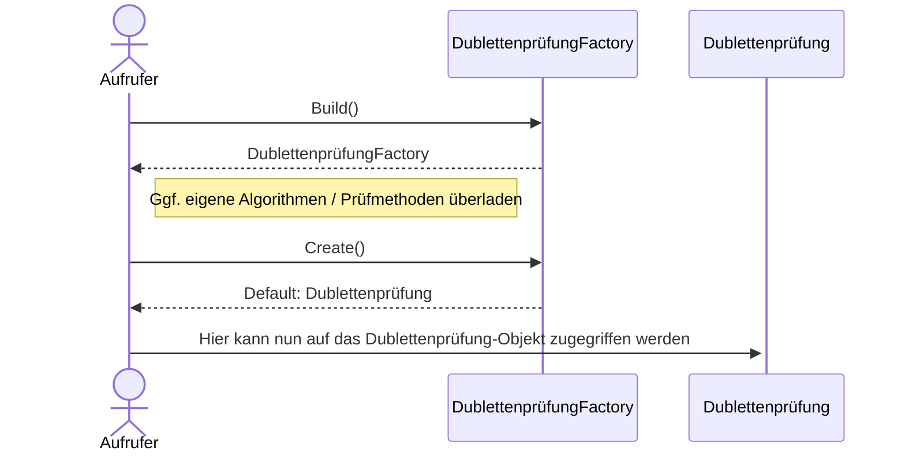
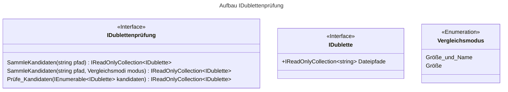

# Bewerbung.Dublette

Eine Bibliothek und Kommandozeilenapplikation um Dubletten innerhalb einer Ordnerstruktur zu identifizieren.


# Instanzierung
Im u.g. Beispiel sieht man die Instanzierung einer DublettenprüfungFactory



# Vergleiche
Ist die Dublettenprüfung-Klasse instanziert, beinhaltet sie folgende Aufrufe zur Ausführung der Vergleichslogik:

   
# Kommandozeilenprogramm:
Das Programm _Dublette.exe_ kapselt die Logik der Klasse IDublettenprüfung und ist wie folgt definiert:

```
Eine Kommandozeilenapplikation um Dubletten innerhalb eines Dateisystems zu identifizeren.

SYNTAX:
    [-fm:FindModus] [-p:Pfad]

Pflichtfeld:
    -p:Pfad          Der Pfad zur Dateistruktur die nach Dubletten durchsucht werden soll.

Optional:
    -fm:FindModus    Der Modus, der für die Erstidentfikation von gleichen Dateien genutzt werden soll. [Standard: 'GN' ]
                FindModus (GN = Größe und Name / G = Größe)
    
AUSGABE:
    Die Rückgabe ist eine Liste von Dubletten, die über den primären FindModus gefunden werden und per MD5-Hashvergleich identisch sind.
```

# Weitere Vorschläge:
<ul>        
    <li> Zusätzlich zur MD5-Prüfung bei Gleichheit noch einen Binärvergleich ermöglichen (ggf. optional, ebenfalls über Modi) um false positives bei Hashvergleichen auszuschließen </li>
    <li> Korrespondierende Async-Methoden damit während die Sammlungen aufgebaut oder validiert wird, im Hauptprogramm weiter gearbeitet werden kann und per await das Hauptprogramm wieder zum Ausführungsfluss zurückkehrt </li>
    <li> Implementation von Cancellationtoken um die Prozesse anhaltbar zu machen </li>
    <li> Vergleichsmodi als Flags umsetzen, da es ja vll später erweitert werden kann. So könnte ich ein Flag aus Size / Name / Drittem Attribut in beliebiger Reihenfolge umsetzen </li>
    <li>Func<string> oder Func<IStatusProgress> in Factory übergeben, damit bei der Prüfung (die ja länger dauern kann) ein Status mitgegeben wird </li>
    <li> Umlaute im Interface vermeiden </li>
</ul>
